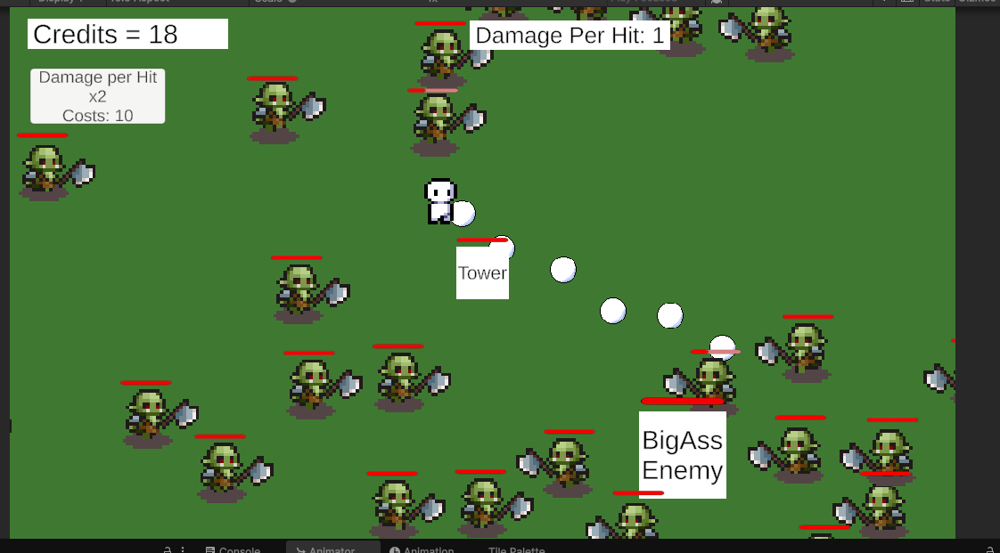

# Tower Defender TryOut

A classic tower defense game built with Unity. Defend your base against waves of incoming enemies by strategically placing and upgrading towers.

---

## Features

- Simple tower placement system
- Player with multiple bullet types and combinations
- Multiple enemy types with health management
- Projectile-based combat
- Wave system with increasing difficulty
- Intuitive user interface

---

## Screenshot



---

## Project Status

This project is currently in the **prototyping phase**. The goal is to create a solid foundation for a full-featured tower defense game. New features are being added and existing components are being improved.

---

## Requirements

- **Unity Version:** 2022.x or newer (tested with [insert version])
- **IDE:** Visual Studio / VS Code
- **Packages:** Only standard Unity packages

---

## Getting Started

1. Clone the repository:
   ```bash
   git clone https://github.com/ZsoltF94/TowerDefender_TryOut.git
   ```
2. Open it in Unity (`File > Open Project`)
3. Open the `SampleScene` under `Assets/Scenes`
4. Press the Play button — and you're good to go!

---

## Project Structure (Excerpt)

```plaintext
Assets/
├── Scripts/         → All gameplay scripts
├── Prefabs/         → Tower, Enemy, Bullet prefabs
├── Scenes/          → Main scene
├── Sprites/         → 2D assets
├── UI/              → User interface elements
```

---

## 📋 Roadmap / ToDos

- [x] Enemy movement
- [x] Towers with projectiles
- [x] Enemy health display
- [ ] Tower upgrades
- [ ] Multiple tower types
- [ ] Player upgrades
- [ ] Bullet upgrades
- [ ] Multiple Bullet types
- [ ] Grid-based tower placement
- [ ] UI and menu improvements
- [ ] Sound effects & music
- [ ] High score system

---


---

## 📄 License

MIT License – see `LICENSE.md` (to be added).

---

## Author

**ZsoltF94**  
GitHub: [github.com/ZsoltF94](https://github.com/ZsoltF94)
